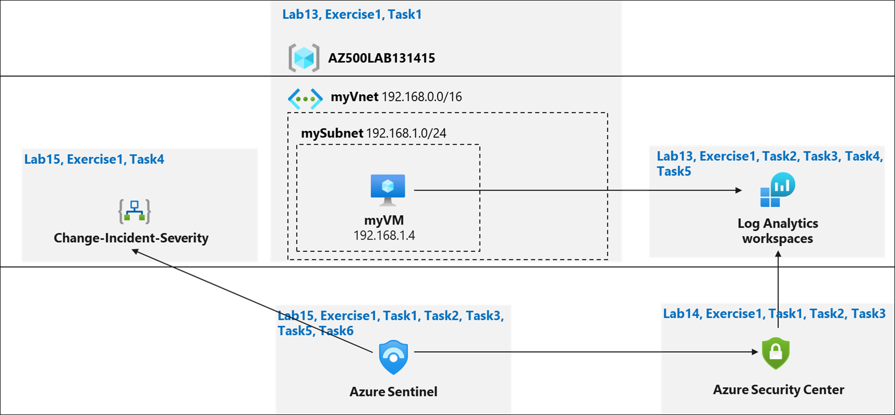

# Lab Scenario Preview: AZ-500: Manage security operations

## Lab 15: Microsoft Sentinel

### Lab overview

You have been asked to create a proof of concept of Microsoft Sentinel-based threat detection and response. Specifically, you want to:
- Start collecting data from Azure Activity and Security Center.
- Add built in and custom alerts 
- Review how Playbooks can be used to automate a response to an incident.

> For all the resources in this lab, we are using the **East US** region. Verify with your instructor this is the region to use for class. 

### Objectives

In this lab, you will complete the following exercise:
- Exercise 1: Implement Microsoft Sentinel

### Architecture Diagram

Once you understand the lab's content, you can start the Hands-on Lab by clicking the **Launch** button located in the top right corner. This will lead you to the lab environment and guide. You can also preview the full lab guide [here](https://experience.cloudlabs.ai/#/labguidepreview/c151c68e-2cc7-4e50-bc81-672aced16480) if you want to go through detailed guide prior to launching lab environment.
