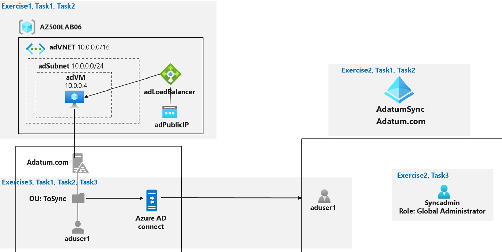

# Lab Scenario Preview: AZ-500: Manage Identity and Access - Part B

## Lab 06: Implement Directory Synchronization

### Lab overview

You have been asked to create a proof of concept demonstrating how to integrate the on-premises Active Directory Domain Services (AD DS) environment with an Azure Active Directory (Azure AD) tenant. Specifically, you want to:
- Implement a single-domain AD DS forest by deploying an Azure VM hosting an AD DS domain controller
- Create and configure an Azure AD tenant
- Synchronize the AD DS forest with the Azure AD tenant

> For all the resources in this lab, we are using the **East US** region. Verify with your instructor this is the region to use for class. 

### Objectives
In this lab, you will complete the following exercises:
- Exercise 1: Deploy an Azure VM hosting an Active Directory domain controller
- Exercise 2: Create and configure an Azure Active Directory tenant
- Exercise 3: Synchronize Active Directory forest with an Azure Active Directory tenant

### Architecture Diagram

Once you understand the lab's content, you can start the Hands-on Lab by clicking the **Launch** button located in the top right corner. This will lead you to the lab environment and guide. You can also preview the full lab guide [here](https://experience.cloudlabs.ai/#/labguidepreview/5329d166-0102-46b1-b250-30334d3c1893) if you want to go through detailed guide prior to launching lab environment.
